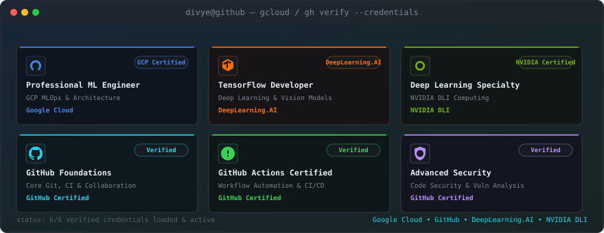

<!-- portrait: python scripts/prep_photo.py source-photo.jpg && python scripts/make_ascii_svg.py
     wordmark:  python scripts/make_wordmark_svg.py --mode rock
     heatmap:   auto-updated daily by .github/workflows/update-profile-art.yml
     about:     python scripts/generate_about_svg.py
     certs:     python scripts/generate_certs_svg.py
     support:   python scripts/generate_support_svg.py -->

<h2><code>divye@github ~ $ whoami</code></h2>

<table>
<tr>
<td valign="top"></td>
<td valign="top"></td>
</tr>
</table>

 

 

 

 

<!-- animated contribution graph: real data, diagonal cell-by-cell reveal
     regenerated daily by .github/workflows/update-profile-art.yml -->

 
 

<!-- About Me Terminal Widget -->

 
 

<!-- Certifications Terminal Widget -->

 
 

  

 
 

